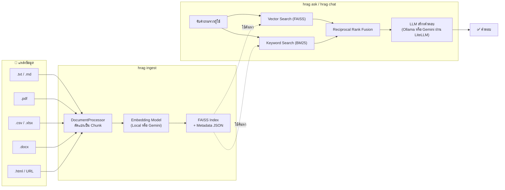
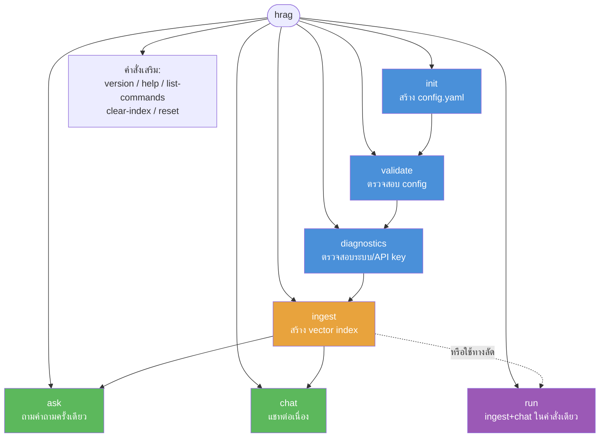
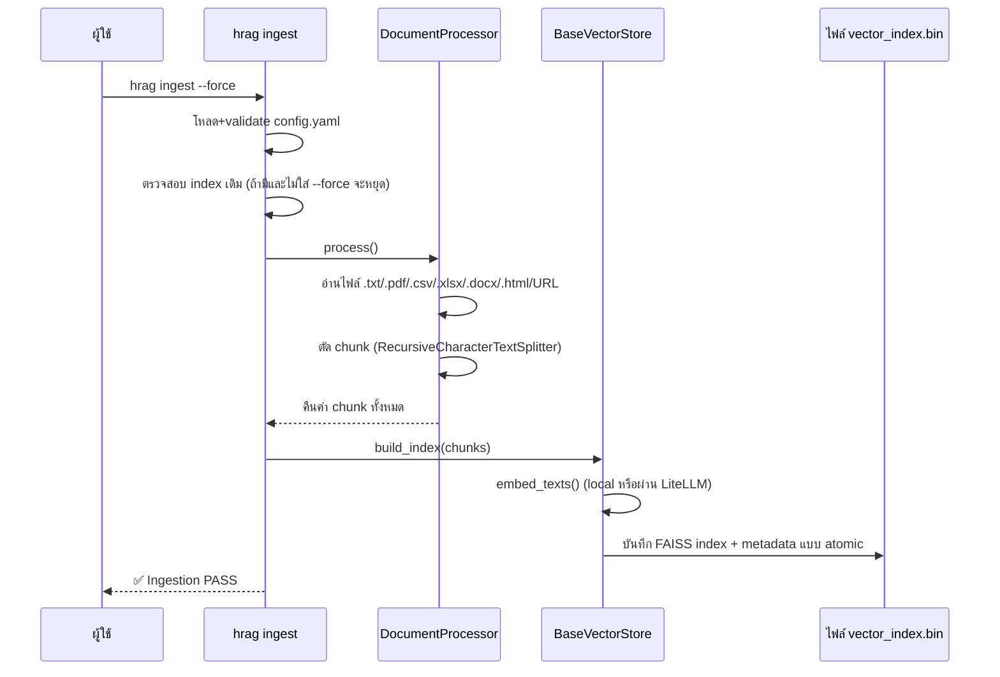
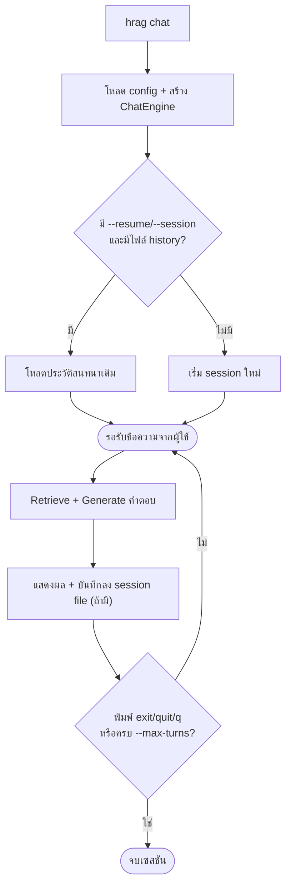

# 🔀 Hybrid RAG CLI (`hrag`)

**Hybrid RAG** คือเครื่องมือบรรทัดคำสั่ง (CLI) สำหรับสร้างระบบ RAG (Retrieval-Augmented Generation) ที่ใช้กับงานวิจัย/เอกสารวิชาการ รองรับการทำงาน 2 โหมด:

- 🖥️ **Offline** — รันโมเดลในเครื่องผ่าน [Ollama](https://ollama.com) + embedding แบบ local (sentence-transformers)
- ☁️ **Online** — เรียก LLM/Embedding ผ่าน API (Gemini เป็นค่าเริ่มต้น ปรับเป็นผู้ให้บริการอื่นได้ผ่าน LiteLLM)

ระบบค้นคืนใช้ **Hybrid Search** (Vector Search ด้วย FAISS + Keyword Search ด้วย BM25) แล้วรวมผลด้วย **Reciprocal Rank Fusion (RRF)** เพื่อความแม่นยำที่สูงขึ้นกว่าการค้นแบบเดียว

---

## 📐 ภาพรวมสถาปัตยกรรมระบบ



---

## ⚙️ การติดตั้ง

### ข้อกำหนดเบื้องต้น
- Python 3.9 ขึ้นไป
- โหมด Offline: ต้องติดตั้งและรัน [Ollama](https://ollama.com) ในเครื่อง
- โหมด Online: ต้องมี API key (ค่าเริ่มต้นคือ `GEMINI_API_KEY`)

### 🚀 วิธีที่ง่ายที่สุด: ติดตั้งผ่าน pip

ชื่อแพ็กเกจบน PyPI คือ **`hybrid-rag`** (ตามที่ระบุใน `pyproject.toml`) ส่วน **`hrag`** คือชื่อคำสั่งที่จะได้มาใช้งานหลังติดตั้ง (ผูกไว้ผ่าน `[project.scripts]`) — ไม่ใช่ชื่อแพ็กเกจ:

```bash
pip install hybrid-rag
```

แนะนำให้ติดตั้งใน virtual environment เพื่อไม่ให้ dependency ชนกับโปรเจกต์อื่น:

```bash
python -m venv .venv
source .venv/bin/activate      # Windows: .\.venv\Scripts\Activate.ps1
pip install hybrid-rag
```

ติดตั้งเสร็จแล้วเรียกใช้ได้ทันที:
```bash
hrag --version
hrag init
```

> ⚠️ **หมายเหตุ:** ต้องมีการ build และ publish แพ็กเกจ (`hybrid-rag`) ขึ้น PyPI ก่อน คำสั่ง `pip install hybrid-rag` จึงจะใช้งานได้จริง หากยังไม่เคย publish ให้ใช้วิธีติดตั้งจาก source ด้านล่างแทนไปก่อน

### 🔧 ติดตั้งจาก Source (สำหรับพัฒนา/ยังไม่ได้ publish ขึ้น PyPI)

**Windows (PowerShell):**
```powershell
python -m venv .venv
.\.venv\Scripts\Activate.ps1
python -m pip install --upgrade pip
pip install -r requirements.txt
pip install -e .
```

**macOS / Linux:**
```bash
python3 -m venv .venv
source .venv/bin/activate
python -m pip install --upgrade pip
pip install -r requirements.txt
pip install -e .
```

หลังติดตั้งสำเร็จ คำสั่ง `hrag` จะพร้อมใช้งานทันทีในบรรทัดคำสั่ง

### ตั้งค่า Environment Variable (จำเป็นสำหรับโหมด Online)

**PowerShell:**
```powershell
$env:GEMINI_API_KEY = "your-api-key-here"
```

**macOS/Linux:**
```bash
export GEMINI_API_KEY="your-api-key-here"
```

---

## 🚦 Flag ระดับ Global (ใช้ก่อนชื่อคำสั่งเสมอ)

Flag เหล่านี้ต้องวาง**ก่อน**ชื่อ subcommand เพราะถูกประมวลผลใน callback หลักของ CLI:

```bash
hrag [GLOBAL FLAGS] <command> [COMMAND OPTIONS]
```

| Flag | ย่อ | ค่าเริ่มต้น | คำอธิบาย |
|---|---|---|---|
| `--verbose` | `-v` | ปิด | แสดง log ระดับ debug ทั้งหมด |
| `--quiet` | `-q` | ปิด | แสดงเฉพาะข้อความจำเป็น (ถ้าใช้คู่กับ `-v`, `-v` จะชนะ) |
| `--no-color` | — | ปิด | ปิดสี/รูปแบบ rich formatting ในผลลัพธ์ |
| `--version` | `-V` | — | แสดงเวอร์ชันของ CLI แล้วออกทันที |

**ตัวอย่าง:**
```bash
hrag --verbose ingest --force
hrag -q ask "สรุปบทที่ 1"
hrag --version
```

---

## 📋 คำสั่งทั้งหมด (Command Reference)



### 1️⃣ `hrag init` — สร้างไฟล์ config.yaml เริ่มต้น

```bash
hrag init
```

| Flag | ย่อ | ค่าเริ่มต้น | คำอธิบาย |
|---|---|---|---|
| `--template` | `-t` | `offline` | เลือก mode เริ่มต้น: `offline` หรือ `online` |
| `--output` | `-o` | `config.yaml` | path ไฟล์ config ที่จะสร้าง |
| `--force` | `-f` | ปิด | เขียนทับไฟล์เดิมถ้ามีอยู่แล้ว (ไม่ใส่ = ถ้าไฟล์มีอยู่แล้วจะหยุดทำงาน) |

**ตัวอย่าง:**
```bash
hrag init --template online --output config.yaml
hrag init --force
```

> 💡 เมื่อสร้างเทมเพลตแบบ `online` ระบบจะใส่ `gemini/gemini-embedding-001` (3072 มิติ) ให้อัตโนมัติ เพราะโมเดลรุ่นเก่า `text-embedding-004` ถูก Google เลิกรองรับแล้ว

---

### 2️⃣ `hrag validate` — ตรวจสอบความถูกต้องของ config

ตรวจ config.yaml ตาม schema (Pydantic) ก่อนนำไปใช้จริง เช่น ตรวจว่า `llm_model` มี provider prefix (`gemini/...`) ตรวจว่ามี API key ในโหมด online ครบหรือไม่

```bash
hrag validate
```

| Flag | ย่อ | คำอธิบาย |
|---|---|---|
| `--config` | `-c` | ระบุ path ไฟล์ config (default: `config.yaml`, หรือใช้ env `RAG_CONFIG`) |
| `--strict` | — | เข้มงวด: ให้ warning ถือเป็น error |
| `--output-format` | `-o` | รูปแบบผลลัพธ์: `text` / `json` / `markdown` |

**ตัวอย่าง:**
```bash
hrag validate --config myconfig.yaml
hrag validate --output-format json
```

ผลลัพธ์: **PASS** (config ถูกต้อง) หรือ **FAIL** (แสดงรายละเอียด error พร้อม exit code 1)

---

### 3️⃣ `hrag diagnostics` — ตรวจสอบระบบและ environment

ตรวจ hardware (CPU/GPU ผ่าน torch ถ้ามี), เวอร์ชัน Python และ environment variable ที่จำเป็น

```bash
hrag diagnostics
```

| Flag | ย่อ | คำอธิบาย |
|---|---|---|
| `--config` | `-c` | ระบุ path ไฟล์ config |
| `--output-format` | `-o` | `text` / `json` / `markdown` |

**ตัวอย่าง:**
```bash
hrag diagnostics --output-format json
```

จะแจ้งเตือนหาก environment variable (เช่น `GEMINI_API_KEY`) ที่ config ต้องการยังไม่ถูกตั้งค่า

---

### 4️⃣ `hrag ingest` — ประมวลผลเอกสารและสร้าง Vector Index



```bash
hrag ingest
```

| Flag | ย่อ | คำอธิบาย |
|---|---|---|
| `--config` | `-c` | path ไฟล์ config (default: `config.yaml`) |
| `--mode` | — | บังคับ mode (`offline`/`online`) สำหรับรอบนี้เท่านั้น ไม่แก้ไฟล์ config |
| `--force` / `--rebuild` | — | **บังคับสร้าง index ใหม่ทับของเดิม** |
| `--dry-run` | — | สแกน+ตัด chunk ดูเฉยๆ ไม่เขียน index จริง |
| `--workers` | `-w` | จำนวน worker ประมวลผลพร้อมกัน (default: 1) |
| `--chunk-size` | — | override ขนาด chunk จาก config |
| `--chunk-overlap` | — | override ค่า overlap ระหว่าง chunk |
| `--include` | — | glob pattern ไฟล์ที่จะรวม (ใส่ซ้ำได้หลายครั้ง) |
| `--exclude` | — | glob pattern ไฟล์ที่จะไม่รวม (ใส่ซ้ำได้หลายครั้ง) |
| `--url` | `-u` | URL ที่จะดึงเนื้อหามา ingest ด้วย (ใส่ซ้ำได้หลายครั้ง) |

**รองรับไฟล์ประเภท:** `.txt` `.md` `.pdf` `.csv` `.xlsx` `.docx` `.html`/`.htm` และหน้าเว็บผ่าน `--url`

**ตัวอย่าง:**
```bash
hrag ingest --dry-run                       # ดูก่อนว่าจะประมวลผลอะไรบ้าง
hrag ingest                                 # สร้าง index ครั้งแรก
hrag ingest --force                         # สร้างใหม่ทับของเดิม
hrag ingest --force --chunk-size 500 --chunk-overlap 100 --include "*.md"
hrag ingest --url "https://example.com/paper" --url "https://example.com/article"
```

> ⚠️ **สำคัญ:** ถ้ามี index เดิมอยู่แล้ว ระบบจะ**ปฏิเสธ**การ ingest เสมอ (ไม่ว่าจะ mode เดิมหรือเปลี่ยน mode ใหม่) เว้นแต่ใส่ `--force` เพราะ index จาก embedding model คนละตัวมีมิติ (dimension) ไม่เท่ากัน ใช้ข้ามกันไม่ได้

---

### 5️⃣ `hrag ask` — ถามคำถามครั้งเดียว (Single Query)

```bash
hrag ask "สรุปเนื้อหาบทที่ 3 ให้หน่อย"
```

| Flag | ย่อ | ค่าเริ่มต้น | คำอธิบาย |
|---|---|---|---|
| `--top-k` | `-k` | `4` | จำนวน chunk ที่ดึงมาใช้เป็น context |
| `--mode` | — | จาก config | override mode สำหรับคำถามนี้ |
| `--model` | `-m` | จาก config | override LLM model สำหรับคำถามนี้ |
| `--system-prompt` | — | ค่ามาตรฐาน | override system prompt |
| `--no-context` | — | ปิด | ข้าม retrieval ถามโมเดลตรงๆ โดยไม่ใช้เอกสาร |
| `--output-format` | `-o` | `text` | `text` / `json` / `markdown` |
| `--save` | — | — | บันทึกคำตอบลงไฟล์ |
| `--config` | `-c` | `config.yaml` | path ไฟล์ config |

**ตัวอย่าง:**
```bash
hrag ask "อธิบายแนวคิดหลักของเอกสาร" --top-k 6
hrag ask "แปลข้อความนี้เป็นอังกฤษ" --no-context --model gemini/gemini-3.5-flash
hrag ask "สรุปให้เป็นตาราง" --output-format markdown --save output.md
```

---

### 6️⃣ `hrag chat` — เปิดเซสชันแชทแบบโต้ตอบ (Interactive)



```bash
hrag chat
```

| Flag | ย่อ | ค่าเริ่มต้น | คำอธิบาย |
|---|---|---|---|
| `--top-k` | `-k` | `2` | จำนวน chunk ที่ดึงต่อ 1 turn |
| `--mode` | — | จาก config | override mode |
| `--model` | `-m` | จาก config | override LLM model สำหรับเซสชันนี้ |
| `--system-prompt` | — | ค่ามาตรฐาน | override system prompt |
| `--max-turns` | — | ไม่จำกัด | จบเซสชันอัตโนมัติหลังครบ N turn |
| `--resume` / `--session` | — | — | ระบุไฟล์บันทึก/โหลดประวัติการสนทนา (JSON) |
| `--no-stream` | — | ปิด | ปิดข้อความสถานะแบบ streaming label |

**ตัวอย่าง:**
```bash
hrag chat --top-k 3
hrag chat --session mysession.json      # บันทึก/โหลดประวัติแชท
hrag chat --max-turns 10 --model gemini/gemini-3.5-flash
```

ระหว่างแชท พิมพ์ `exit`, `quit` หรือ `q` เพื่อออก หรือกด `Ctrl+C` / `Ctrl+D`

---

### 7️⃣ `hrag run` — ทางลัดคำสั่งเดียว (init → ingest → chat)

รวมทุกขั้นตอนไว้ในคำสั่งเดียว: validate config → สร้าง index อัตโนมัติถ้ายังไม่มี (หรือถ้าใส่ `--reingest`) → เข้าสู่โหมดแชททันที เหมาะสำหรับผู้เริ่มต้นที่ไม่อยากรันหลายคำสั่งแยกกัน

```bash
hrag run
```

| Flag | ย่อ | คำอธิบาย |
|---|---|---|
| `--config` | `-c` | path ไฟล์ config |
| `--top-k` | `-k` | จำนวน chunk ที่ดึงต่อ turn (default: 2) |
| `--mode` | — | override mode |
| `--model` | `-m` | override LLM model |
| `--system-prompt` | — | override system prompt |
| `--reingest` | — | บังคับสร้าง index ใหม่แม้จะมีอยู่แล้ว |

**ตัวอย่าง:**
```bash
hrag run
hrag run --reingest --model gemini/gemini-3.5-flash
```

---

### 🧰 คำสั่งเสริมอื่นๆ

| คำสั่ง | หน้าที่ | ตัวอย่าง |
|---|---|---|
| `hrag version` | แสดงเวอร์ชันของ CLI | `hrag version` |
| `hrag help` | แสดงรายการคำสั่งทั้งหมดพร้อมคำอธิบาย | `hrag help` |
| `hrag list-commands` | แสดงรายการคำสั่งทั้งหมด (แบบสั้น) | `hrag list-commands` |
| `hrag clear-index` | ลบไฟล์ vector index + metadata ทิ้ง | `hrag clear-index` |
| `hrag reset` | ลบ index ทั้งหมด แล้วสร้าง config.yaml ใหม่ (มีถามยืนยันก่อน เว้นแต่ใส่ `--force`) | `hrag reset --force` |

`clear-index` รับ flag เพิ่มเติมได้: `--index-path`/`-i` และ `--metadata-path`/`-m` เพื่อระบุ path ไฟล์ที่ไม่ใช่ค่าเริ่มต้น

---

## 📄 โครงสร้างไฟล์ config.yaml

```yaml
project_name: research_rag_project
mode: online                 # หรือ offline
offline:
  vector_db: faiss
  llm_model: ollama/llama3.2:1b
  embedding_model: sentence-transformers/all-MiniLM-L6-v2
  api_key_env_var: null
online:
  vector_db: faiss
  llm_model: gemini/gemini-3.5-flash
  embedding_model: gemini/gemini-embedding-001
  api_key_env_var: GEMINI_API_KEY
data:
  docs_path: ./data
  chunk_size: 1000
  chunk_overlap: 200
```

**ข้อกำหนดสำคัญของ schema:**
- `chunk_overlap` ต้อง**น้อยกว่า** `chunk_size` เสมอ
- โมเดลในโหมด `online` ต้องมี LiteLLM provider prefix เช่น `gemini/...`, `openai/...`, `anthropic/...` — ถ้าใส่แค่ `gemini-3.5-flash` โดยไม่มี prefix จะ validate ไม่ผ่าน
- โหมด `online` ต้องมี `api_key_env_var` และ environment variable ตัวนั้นต้องถูกตั้งค่าไว้จริงในระบบ

---

## 🔁 Workflow แนะนำสำหรับผู้เริ่มต้น


```bash
hrag init --template online
# แก้ config.yaml: embedding_model, docs_path, api key env var
hrag validate
hrag diagnostics
hrag ingest --dry-run
hrag ingest
hrag ask "คำถามของฉันคืออะไร"
# หรือ
hrag chat
```

หรือใช้ทางลัดคำสั่งเดียว:
```bash
hrag init --template online
hrag run
```

---

## 🛠️ การแก้ปัญหาที่พบบ่อย (Troubleshooting)

### ❌ `404 Not Found` ตอนเรียก embed_content (โหมด online)

**สาเหตุ:** `embedding_model` ใน config ผิด หรือใช้โมเดลที่ Google เลิกรองรับแล้ว (เช่น `text-embedding-004`)

**วิธีแก้:**
```yaml
online:
  embedding_model: gemini/gemini-embedding-001
```
แล้ว rebuild index ใหม่ (จำเป็น เพราะ dimension เปลี่ยนจาก 768 → 3072):
```bash
hrag ingest --force
```

### ❌ Ingest ไม่ได้หลังเปลี่ยน mode

**สาเหตุ:** มี index เก่าอยู่ และ CLI ป้องกันไม่ให้ทับโดยไม่ตั้งใจ

**วิธีแก้:** เพิ่ม `--force` ท้ายคำสั่ง `hrag ingest` หรือใช้ `hrag clear-index` ก่อน

### ⚠️ `Missing required environment variables`

**สาเหตุ:** ยังไม่ได้ตั้งค่า API key (เช่น `GEMINI_API_KEY`)

**วิธีแก้:**
```bash
# macOS/Linux
export GEMINI_API_KEY="your-api-key-here"
# Windows PowerShell
$env:GEMINI_API_KEY = "your-api-key-here"
```

### ❌ Ollama Out of GPU Memory (โหมด offline)

**วิธีแก้:**
```bash
nvidia-smi                              # ตรวจ VRAM ว่าง
OLLAMA_LLM_LIBRARY=cpu ollama serve     # บังคับรันบน CPU ล้วน
```

### ❌ `Vector database not found`

**สาเหตุ:** ยังไม่เคย ingest เอกสาร

**วิธีแก้:** รัน `hrag ingest` ก่อนใช้ `hrag ask` หรือ `hrag chat`

---

## 📁 โครงสร้างโปรเจกต์

```
hybrid_rag/
├── cli.py                 # จุดเริ่มต้นคำสั่ง CLI ทั้งหมด (Typer)
├── schema.py               # Pydantic schema สำหรับ validate config.yaml
├── env_diagnostics.py       # ตรวจ hardware / environment variable
├── data_loader.py           # DocumentProcessor: อ่าน+ตัด chunk เอกสาร
├── vector_store.py          # BaseVectorStore + HybridSearchEngine (FAISS+BM25+RRF)
├── chat_engine.py           # ChatEngine: retrieval + เรียก LLM ผ่าน LiteLLM
├── config.yaml              # ไฟล์ config การทำงาน
├── data/                    # โฟลเดอร์เก็บเอกสารต้นฉบับ
├── vector_index.bin         # FAISS index ที่สร้างขึ้น
└── vector_metadata.json     # metadata ของแต่ละ chunk
```

---

## 📦 Dependencies หลัก

| Library | หน้าที่ |
|---|---|
| `typer` | สร้าง CLI interface |
| `rich` | จัดรูปแบบผลลัพธ์สวยงามในเทอร์มินัล |
| `pydantic` | ตรวจสอบ schema ของ config.yaml |
| `litellm` | เป็นชั้นกลางเรียก LLM/Embedding หลายผู้ให้บริการด้วย interface เดียว |
| `faiss-cpu` | Vector database สำหรับ semantic search |
| `rank_bm25` | Keyword search (BM25) สำหรับ hybrid retrieval |
| `sentence-transformers` | Embedding model แบบรันในเครื่อง (offline mode) |
| `pymupdf`, `python-docx`, `pandas`, `openpyxl`, `beautifulsoup4` | อ่านไฟล์เอกสารหลายประเภท (PDF, DOCX, CSV, Excel, HTML) |

---

**License:** MIT
